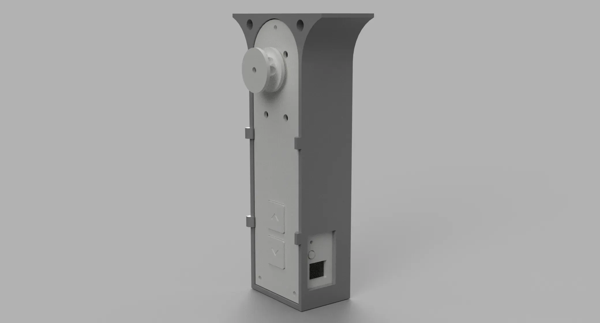
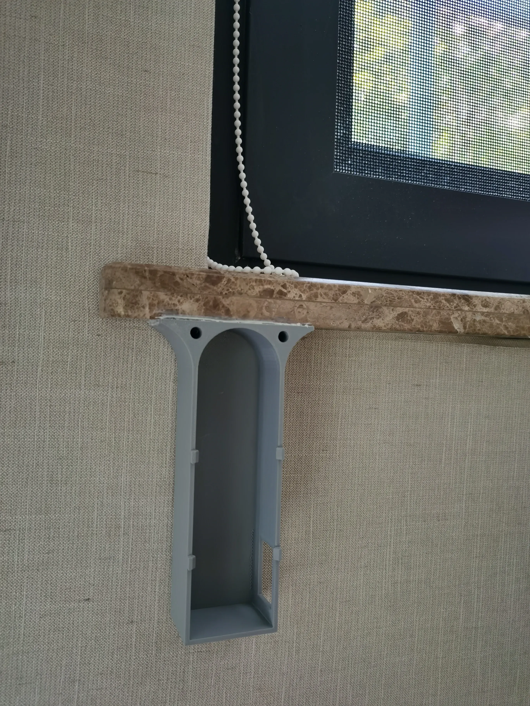
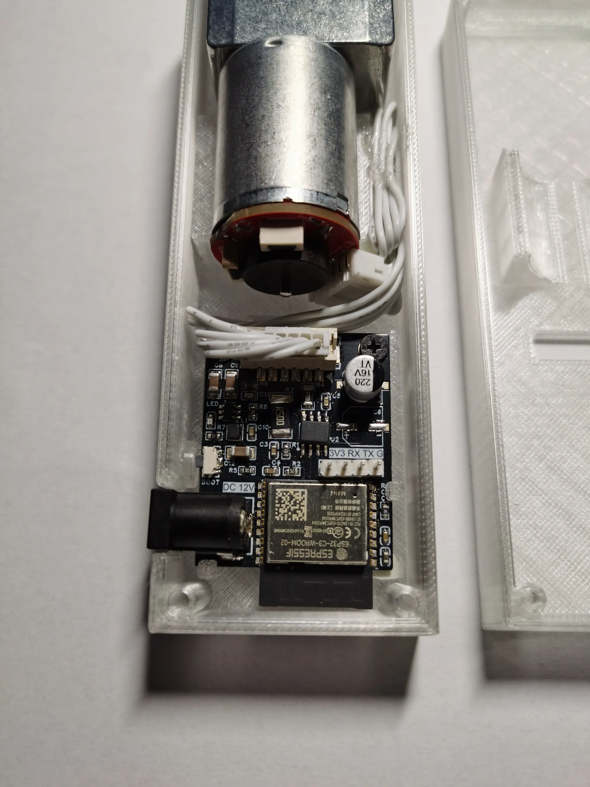
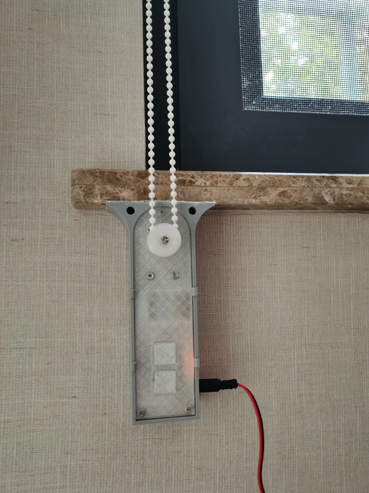
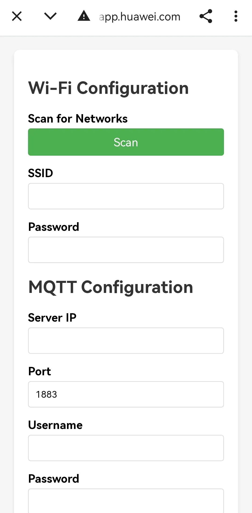
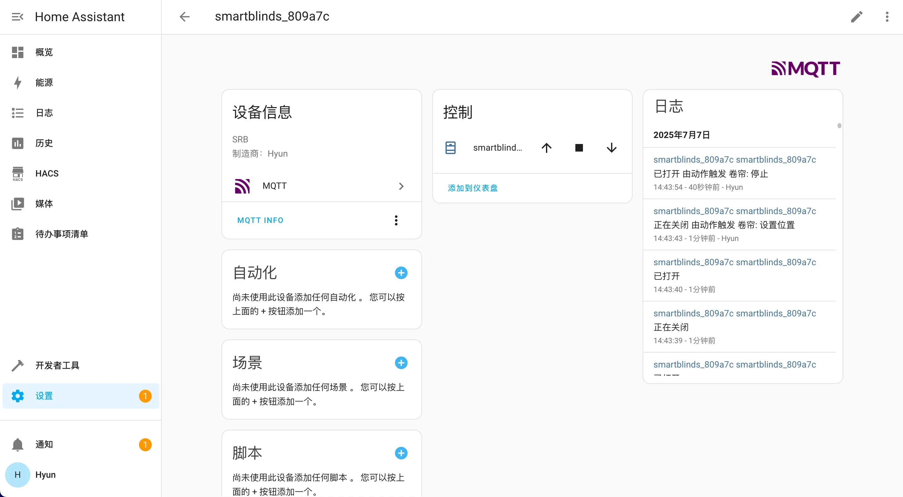

# SmartRollerBlinds
> 一款基于 ESP32-C3 的低成本、高精度 DIY 智能卷帘电机方案。



<p align="center">
    <a href="#" style="display: inline-block;"></a>
    <a href="#" style="display: inline-block;"></a>
    <a href="https://www.home-assistant.io/" style="display: inline-block;"></a>
</p>

## ✨ 功能特性 (Features)

*   **🛠️ 低成本 DIY**：核心组件均为常见物料，易于采购和组装。
*   **🎯 精准控制**：采用 PID 算法，实现电机位置的精确控制和定位。
*   **💾 断电记忆**：校准后的开合位置、电机当前位置都会被记忆，断电后无需重新校准。
*   **🔗 多种控制方式**：支持 MQTT、物理按键、串口调试等多种控制方式，灵活适应不同场景。
*   **🏠 智能家居集成**：支持 Home Assistant MQTT 自动发现，无缝接入您的智能家居系统。

## 📸 效果演示 (Showcase)


## 📦 所需物料 (Bill of Materials)
> 可以在底部下载完整物料清单

*   主板
*   12V 电源
*   370 减速电机（12V, 40转/分, 带编码器）
*   3D 打印外壳与支架
*   若干螺丝

## 🚀 快速上手 (Getting Started)

请按照以下步骤完成设备的安装和配置。

### 1. 硬件组装与安装

1.  **固定支架**：使用胶或螺丝，将电机支架固定在窗帘的合适位置。确保卷帘绳索能被电机拉动且保持绷紧状态。
    <p align="center"></p>

2.  **组装电机**：将电机和主控板放入 3D 打印外壳中，并完成接线。
    <p align="center">
      
    </p>

3.  **安装主体**：将组装好的电机主体放入支架中。
    <p align="center">
      
    </p>


### 2. 固件编译
推荐使用 **VSCode + ESP-IDF 插件** 进行开发。

1.  **环境准备**: 克隆本仓库并打开 `firmware` 文件夹，并确保已正确安装和配置 ESP-IDF 开发环境。
2.  **自定义配置**:
    *   **VSCode**: 单击底部状态栏的齿轮图标 `⚙️` 或运行 `ESP-IDF: SDK Configuration editor` 命令打开图形化配置界面。
    *   **命令行**: 在项目根目录运行 `idf.py menuconfig`。
    *   找到 `SmartRollerBlinds Configuration` 菜单进行您需要的修改（如 GPIO、电机方向等）。
3.  **编译固件**:
    *   **VSCode**: 单击底部状态栏的 `Build` 按钮。
    *   **命令行**: 运行 `idf.py build`。

### 3. 固件烧录 / Flashing the Firmware
您可以直接通过以下方式烧录：

*   **VSCode**: 点击底部状态栏的 `Flash` 按钮，插件会自动完成所有操作。
*   **命令行**: 运行 `idf.py -p YOUR_SERIAL_PORT flash`。

---

### ⚠️ **重要：禁用 JTAG 引脚**
> 为了防止电机在上电或复位过程中因引脚状态不确定而意外转动，必须在首次烧录后执行一次性 eFuse 烧写操作来禁用 JTAG 功能。

**注意：此操作是永久性的，不可逆！**

1.  保持主板与电脑的串口连接。
2.  打开 IDF 终端，执行以下命令。同样，请将 `YOUR_SERIAL_PORT` 替换为您的设备串口。
    ```bash
    espefuse --port YOUR_SERIAL_PORT burn_efuse DIS_PAD_JTAG
    ```

3.  看到 `eFuse burned.` 或类似成功提示即表示完成。现在您可以断开设备并进行后续步骤了。

---

### 4. 网络配置
1.  **连接电源**：确保电机已连接到 12V 电源。首次上电或重置后，设备将自动进入配网模式。
2.  **进入配网模式**：当设备处于配网模式时，板载 LED 会**快速闪烁**。
3.  **连接热点**：使用手机或电脑，连接到名为 `SRB-<mac_address>` 的 Wi-Fi 热点。
4.  **配置信息**：
    *   连接热点后，设备会自动弹出配置页面。
        <p align="center">
          
        </p>
    *   在页面中输入您家里的 **Wi-Fi 名称 (SSID)** 和 **密码**。
    *   输入您的 **MQTT 服务器地址**、**端口**（默认 `1883`）、用户名和密码（如有）。
    *   点击“保存”。
5.  **完成配置**：设备将自动重启并连接到您配置的网络。连接成功后，LED 将变为**常亮**状态。
    *   **提示**：如果您的 Home Assistant 启用了 MQTT 自动发现功能，此时设备将自动出现在 Home Assistant 的设备列表中。

### 5. 行程校准

首次使用时，需要校准卷帘的完全打开（上限）和完全关闭（下限）位置。

1.  **设置上限位置**：
    *   **长按** `UP ▲` 键，电机向上转动。
    *   当卷帘到达您期望的**完全打开**位置时，**短按** `DOWN ▼` 键，电机停止。此时，上限位置已被记录。
2.  **设置下限位置**：
    *   **长按** `DOWN ▼` 键，电机向下转动。
    *   当卷帘到达您期望的**完全关闭**位置时，**短按** `UP ▲` 键，电机停止。此时，下限位置已被记录。

校准完成！现在您可以通过按键或智能家居系统控制它了。

## 🏠 智能家居集成 (Smart Home Integration)

如果您的 Home Assistant 启用了 MQTT 自动发现功能，设备在成功连接网络后将自动出现在 Home Assistant 的设备列表中，无需任何手动配置。

<p align="center">
    
</p>

## 🕹️ 操作指南 (Usage)

| 操作 (Action) | 功能 (Function) |
| :--- | :--- |
| **短按** `UP ▲` / `DOWN ▼` | 移动到已校准的上限/下限位置、停止运动（运动时按相反方向键） |
| **双击** `UP ▲` / `DOWN ▼` | 向上/向下微调一小段距离 |
| **长按** `UP ▲` 或 `DOWN ▼` | 开始行程校准（**将覆盖之前结果**） |
| **长按** `Boot` 键 (侧边) | 进入 Wi-Fi 配网模式（**将删除保存的WIFI信息**） |

## ⚙️ 高级配置 (Advanced Configuration)

如果您希望修改一些默认行为（如电机反转、双击微调的移动距离、GPIO 引脚定义等），可以通过 `menuconfig` 进行配置。

*   **命令行方式**：在项目根目录运行 `idf.py menuconfig`，然后进入 `SmartRollerBlinds Configuration` 菜单进行修改。
*   **VSCode 方式**：使用 VSCode 的 ESP-IDF 插件，单击底部状态栏的齿轮图标 `⚙️`，即可进入图形化配置界面。

## 🔧 故障排查 (Troubleshooting)

### PID 参数调整

**问题现象**：电机在运行时出现明显抖动、噪音过大或无法稳定在目标位置。

这通常意味着默认的 PID 参数不适用于您的电机或负载，需要手动调整。您可以通过以下三种方式进行调整：

1.  **通过串口调整**
    -   连接设备的串口，发送以下格式的命令：
        ```bash
        set_pid <kp> <ki> <kd>
        ```
    *   例如: `set_pid 1.2 0.5 0.8`

2.  **通过 MQTT 调整**
    *   向 MQTT 主题 `<base_topic>/command` 发送与串口格式相同的 payload。
    *   例如，在 Home Assistant 的 `MQTT -> 发布数据包` 中：
        *   **主题**: `blinds/living_room/command`
        *   **荷载**: `set_pid 1.2 0.5 0.8`

3.  **通过 menuconfig 调整**
    *   在 `idf.py menuconfig` 的 `SmartRollerBlinds Configuration` 菜单中，找到 PID 相关的参数项直接修改，然后重新编译并烧录固件。