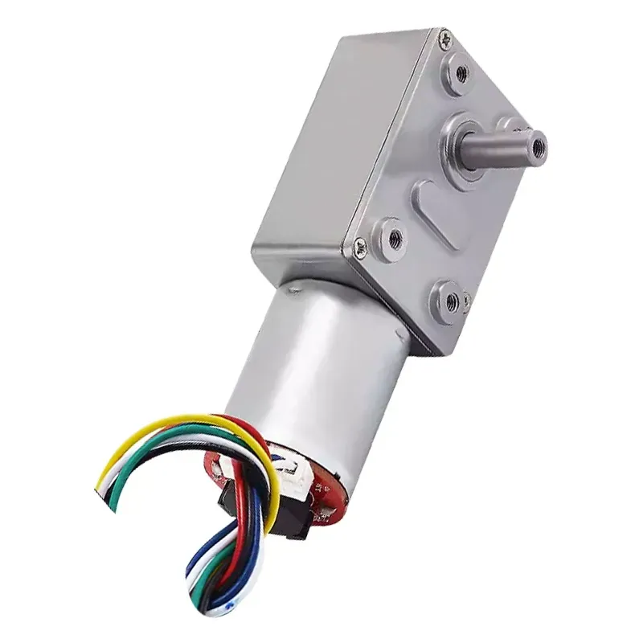

<p align="right">
English | <a href="./README.zh.md">中文</a>
</p>

# SmartRollerBlinds
> A low-cost, high-precision DIY smart roller blind motor solution based on ESP32-C3.


<p align="center">
    <a href="#" style="display: inline-block;"></a>
    <a href="#" style="display: inline-block;"></a>
    <a href="https://www.home-assistant.io/" style="display: inline-block;"></a>
</p>

## ✨ Features

*   **🛠️ Low-Cost DIY**: Core components are common materials, easy to source and assemble.
*   **🎯 Precise Positioning**: PID motor position control, supports setting a specific open/close percentage.
*   **💾 Power-off Memory**: Calibrated open/close positions and the current motor position are saved, no recalibration is needed after a power outage.
*   **🔗 Multiple Control Methods**: Supports MQTT, physical buttons, serial debugging, etc., making it flexible for different scenarios.
*   **🏠 Smart Home Integration**: Supports Home Assistant MQTT auto-discovery for seamless integration into your smart home system.

## 📦 Bill of Materials (BOM)
*   Mainboard (PCB)
*   12V Power Supply
*   370 Geared Motor (12V, 40 RPM, with encoder)  
    
*   3D-printed case and bracket
*   Screws

## 🚀 Getting Started

Please follow the steps below to install and configure the device.

### 1. Hardware Assembly and Installation

> **⚠️ Note on Pull Cords**
> 
> This device is **not compatible** with pull cords that have large **connectors or stoppers** (common on beaded chains). The connector can get stuck in the motor's gear, causing malfunction or damage.
> 
> Before installation, please ensure your pull cord is a **continuous closed loop**. If your cord has a connector:
> *   Replace it with a seamless, continuous closed-loop cord.
> *   Carefully remove the connector and securely join the ends using methods like tying a knot, sewing with a needle and thread, or binding with a thin string.


#### Assembly Steps

1.  **Mount the Bracket**: Use glue or screws to fix the motor bracket in a suitable position. Ensure the pull cord can be driven by the motor and remains taut.
    <p align="center"></p>

2.  **Assemble the Motor**: Place the motor and the mainboard into the 3D-printed case and complete the wiring.
    > **💡 Hardware Tip: Regarding Circuit Soldering**
    >
    > The components `R1`, `C3`, and `R3` on the PCB are reserved for a motor current sampling feature. **The current firmware version does not use this feature**.
    > Therefore, during soldering:
    > *   `R1` and `C3` can be left **uninstalled**.
    > *   The pads for `R3` must be **shorted** (you can use a `0R` resistor or simply bridge the pads with a blob of solder).
    <p align="center">
      
    </p>

3.  **Install the Main Unit**: Place the assembled motor unit into the bracket.
    <p align="center">
      
    </p>


### 2. Firmware Compilation
Using the **VSCode + ESP-IDF extension** for development is highly recommended.

1.  **Environment Setup**: Clone this repository, open the `firmware` folder, and ensure the ESP-IDF development environment is correctly installed and configured.
2.  **Custom Configuration**:
    *   **VSCode**: Click the gear icon `⚙️` on the bottom status bar or run the `ESP-IDF: SDK Configuration editor` command to open the graphical configuration interface.
    *   **Command Line**: Run `idf.py menuconfig` in the project's root directory.
    *   Find the `SmartRollerBlinds Configuration` menu to make your desired changes (e.g., GPIO, motor direction).
3.  **Compile the Firmware**:
    *   **VSCode**: Click the `Build` button on the bottom status bar.
    *   **Command Line**: Run `idf.py build`.

### 3. Flashing the Firmware
You can flash the firmware directly using one of the following methods:

*   **VSCode**: Click the `Flash` button on the bottom status bar. The extension will handle everything automatically.
*   **Command Line**: Run `idf.py -p YOUR_SERIAL_PORT flash`.

---

### ⚠️ **Important: Disable JTAG Pins**
> To prevent the motor from turning unexpectedly during power-up or reset due to indeterminate pin states, you must perform a one-time eFuse burn to disable the JTAG feature after the initial flashing.

**Note: This operation is permanent and irreversible!**

1.  Keep the mainboard connected to your computer via serial.
2.  Open the IDF terminal and execute the following command. Remember to replace `YOUR_SERIAL_PORT` with your device's actual serial port.
    ```bash
    espefuse --port YOUR_SERIAL_PORT burn_efuse DIS_PAD_JTAG
    ```

3.  When you see `eFuse burned.` or a similar success message, the process is complete. You can now disconnect the device and proceed to the next steps.

---

### 4. Network Configuration
1.  **Connect Power**: Ensure the motor is connected to a 12V power supply. The device will automatically enter provisioning mode on first power-up or after a reset.
2.  **Enter Provisioning Mode**: The onboard LED will **blink rapidly** when the device is in provisioning mode.
3.  **Connect to Hotspot**: Use your phone or computer to connect to the Wi-Fi hotspot named `SRB-<mac_address>`.
4.  **Configure Credentials**:
    *   After connecting, a configuration page will pop up automatically.
        <p align="center">
          
        </p>
    *   Enter your home **Wi-Fi name (SSID)** and **password**.
    *   Enter your **MQTT server address**, **port** (default `1883`), and username/password if required.
    *   Click "Save".
5.  **Configuration Complete**: The device will restart and connect to your configured network. Once successful, the LED will become **solid on**.
    *   **Tip**: If MQTT auto-discovery is enabled in your Home Assistant, the device will now automatically appear in the device list.

### 5. Travel Calibration

On first use, you need to calibrate the fully open (upper limit) and fully closed (lower limit) positions of the blinds.

1.  **Set the Upper Limit**:
    *   **Long-press** the `UP ▲` button, and the motor will move upwards.
    *   When the blinds reach your desired **fully open** position, **short-press** the `DOWN ▼` button. The motor will stop, and the upper limit is now saved.
2.  **Set the Lower Limit**:
    *   **Long-press** the `DOWN ▼` button, and the motor will move downwards.
    *   When the blinds reach your desired **fully closed** position, **short-press** the `UP ▲` button. The motor will stop, and the lower limit is now saved.

Calibration complete! You can now control your blinds via the buttons or your smart home system.

## 🏠 Smart Home Integration

If MQTT auto-discovery is enabled in your Home Assistant, the device will automatically appear in the device list after connecting to the network, with no manual configuration required.

<p align="center">
    
</p>

## 🕹️ Usage

| Action | Function |
| :--- | :--- |
| **Short-press** `UP ▲` / `DOWN ▼` | Move to calibrated upper/lower limit; Press opposite key during movement to stop. |
| **Double-press** `UP ▲` / `DOWN ▼` | Nudge up/down a short distance. |
| **Long-press** `UP ▲` or `DOWN ▼` | Start travel calibration (**will overwrite previous settings**). |
| **Long-press** `Boot` button (side) | Enter Wi-Fi provisioning mode (**will delete saved Wi-Fi credentials**). |

## ⚙️ Advanced Configuration

If you wish to modify default behaviors (e.g., motor direction, nudge distance, GPIO pin definitions), you can do so via `menuconfig`.

*   **Command Line Method**: Run `idf.py menuconfig` in the project's root directory, then navigate to the `SmartRollerBlinds Configuration` menu to make changes.
*   **VSCode Method**: Using the ESP-IDF extension in VSCode, click the gear icon `⚙️` on the bottom status bar to open the graphical configuration interface.

## 🔧 Troubleshooting

### PID Tuning

**Symptom**: The motor jitters, is excessively noisy during operation, or fails to hold its position stably.

This usually means the default PID parameters are not suitable for your specific motor or load and require manual tuning. You can adjust the parameters in one of three ways:

1.  **Via Serial Port**
    -   Connect to the device's serial port and send a command in the following format:
        ```bash
        set_pid <kp> <ki> <kd>
        ```
    *   Example: `set_pid 1.2 0.5 0.8`

2.  **Via MQTT**
    *   Publish a payload with the same format to the `<base_topic>/command` MQTT topic.
    *   For example, in Home Assistant's `MQTT -> Publish a packet` tool:
        *   **Topic**: `blinds/living_room/command`
        *   **Payload**: `set_pid 1.2 0.5 0.8`

3.  **Via menuconfig**
    *   In the `SmartRollerBlinds Configuration` menu within `idf.py menuconfig`, find the PID-related parameters, modify them directly, then recompile and flash the firmware.